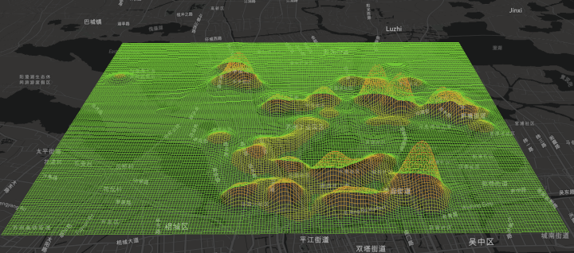

## 一、前言
最近工作上需要实现一个地图动画效果，简单的动画效果，是的，简单；不过在此之前，我并不认为它简单，需要有一点点的webgl、three.js的基础。

效果大概就是一个网格起伏热力图的动画，像心跳一样、heartbeat……，像这样。


上面这个动效，它好像是基于一个gltf模型来做的，它不给地图交互，现在我们也想实现类似的效果，我们最后实现的效果跟这个效果比还有点差距，我们慢慢靠近它，然后再做的更好。

现在有8个月的道路违法停车数据，基于这八个月的数据，做空间插值，生成规则网格。基于规则网格数据，使用mapboxgl和three.js来实现类似的这个效果。我的[github地址](https://github.com/limzgiser/mapbox-gl-grid-heatmap)。

## 二、数据准备
通过空间插值、生成渔网、统计网格违停数量，网格转出矩阵点，重复处理八个月的数据。熟悉ArcMap或QGIS的同学，这些数据处理过程应该比较熟悉的，如何服务化处理这个过程是需要考虑的。或者你采用一些图像处理的方式，来处理这些数据。这里不介绍数据处理过程。列出数据处理后的结果数据。


-9999 是空值

```javascript
经度                 维度               违停数量
120.633570199999994 31.4307066000000042 -9999
120.634570199999985 31.4307066000000042 1.2536
120.635570199999989 31.4307066000000042 2.3524
```
为了方便后面绘图，将八个月的数据合并为一个文件，每条记录表示一个网格点，分别为：经度坐标、维度坐标、一到八月违停数量。


```javascript
经度,维度,1月,2月,3月,4月,5月,6月,7月,8月,
120.633570199999994,31.4307066000000042,0,0,0,0,0,0,0,0
120.634570199999985,31.4307066000000042,0,0,0,0,0,0,0,0
120.635570199999989,31.4307066000000042,0,0,0,0,0,0,0
```

## 三、绘制网格

再确认一下，我们的数据结构。一共201行、198列，共39789个点 ，每条记录包含如下信息。
```javascript
经度,维度,1月,2月,3月,4月,5月,6月,7月,8月,
```
### 1、坐标转换
在mapboxgl中绘制的是投影坐标，我们读取数据将数据转换为投影坐标。threebox是mapboxgl的一个插件，他可以帮助我们在mapboxgl中使用three.js开发扩展。
```javascript
// tb - threebox对象，连接mapboxgl和three.js的插件
// dataStr 数据字符串，我们数据是以文本方式存储在txt文件中的
function dataFormat(tb, dataStr) {
        let points = [];
        dataStr.split('\n').map(function (s, i) {
           let splitArray = s.split(',');
           let ll = [parseFloat(splitArray[0]), parseFloat(splitArray[1])];
             let {
                    x,
                    y,
                    z
             } = tb.projectToWorld(ll) // 将经纬度转换投影坐标
             points.push([...[x, y], ...splitArray.splice(2).map(i => Number(i))])
         });
        return points;
 }
```
### 2、获取网格线

我的网格是按列排序的，网格点的索引是按照列向递增的。最终绘制的是网格线，所以需要提取网格线。如果，我们有一个画笔，可以一笔画出一个201*198的棋盘吗？答案是可以的，只不过会出现重复的路径，你可以从性能优化的方面考虑，在这里做优化，绘制几根线，尽量少点。为了简单，我就绘制201行+198列 = 399条线来生成网格。
``` javascript
 function arrSplit(tb, datStr) {
    let resArr = dataFormat(tb, datStr);
    let rows = _.chunk(resArr, row);
    let colums = [];
       let tmpColums = [];
       for (let i = 0; i < row; i++) {
           for (let j = 0; j < column; j++) {
              let item = resArr[row * j + i]
              tmpColums.push(item);
            }
          }
       colums = _.chunk(tmpColums, column);
       return [...rows, ...colums];
 }
```
### 3、绘制网格线
画线的时候，需要注意，我们绘制的线有点特殊，每个节点都有高度和颜色属性。线段的节点颜色不同，webgl在光栅化的时候，线段中间的颜色会根据节点颜色进行插值。网格热图的效果就是这么做的。
```javascript
function drawLine(row) {
	let vertices = [];
	let colors = [];
	let geometry = new THREE.Geometry();
	row.forEach((coordinate) => {
		let [x, y, z] = [coordinate[0], coordinate[1], coordinate[2]];
		vertices.push(new THREE.Vector3(x, y, z));
		colors.push(getColorByValue(z));
	});
	let material = new THREE.LineBasicMaterial({
		linewidth: 1,
		vertexColors: THREE.VertexColors,
		//blending: THREE.AdditiveBlending
	});
	geometry.vertices = vertices;
	geometry.colors = colors;
	let lineMesh = new THREE.Line(geometry, material);
	lineMesh.geometry.verticesNeedUpdate = true;
	lineMesh.geometry.colorsNeedUpdate = true;
	return lineMesh;
}
```
节点的颜色和高度自然就根据每个网格点的违停插值量来计算。提前定制一个色带，因为，我不想每个颜色都去创建一个THREE.Color对象。如果你嫌太高，可以在上面Z值乘上一个Z方向的缩放系数。
```javascript
let colors = [
    new THREE.Color(`rgb( 113, 196, 54)`),
    new THREE.Color(`rgb( 113, 196, 54)`),
    new THREE.Color(`rgb( 171, 190, 52)`),
    new THREE.Color(`rgb( 201, 155, 52)`),
    new THREE.Color(`rgb( 205, 122, 45)`),
    new THREE.Color(`rgb( 214, 96, 53)`),
    new THREE.Color(`rgb( 234, 57, 45)`),
    new THREE.Color(`rgb( 234, 57, 45)`)
]
function getColorByValue(value) {
    let tvalue = Number(value)
    if (tvalue < 1) {
        return colors[0];
    } else if (tvalue <= 5) {
        return colors[1];
    } else if (tvalue < 15) {
        return colors[2];
    } else if (tvalue < 30) {
        return colors[3];
    } else if (tvalue < 50) {
        return colors[4];
    } else if (tvalue < 80) {
        return colors[5];
    } else {
        return colors[7];
    }
}
```
### 4、绘制结果
结果是这样的，看起来，是我们预期的结果。



## 四、网格动画
动画就是“补间”，弥补中间值。某一个网格点从一月的违停数量 1 增加到 10 ，我们希望它这个过程用时两秒，就需要中间插值。插多少呢？如果，我们希望一秒达到55幁，当然一秒能不能达到55，这是由浏览器决定的，假如我们机器跟得上。想要网格点用时两秒从1平缓的变到10，我需要在中间插值110个点左右。
### 1、补间插值
tween.js 是一个很不错的补间动画库。例如：endPointIndex 从0增长到60 ，这个过程希望用3秒的时间。同时可以监测到值变化的中间过程，和动画完成后的回调函数。
```javascript
let aniindexArr = new Array(8).fill({
	endPointIndex: 0,
});
// endPointIndex 从0 - 60 用时三秒
let tween1 = new TWEEN.Tween(aniindexArr)
	.to({ endPointIndex: 60 }, 3000) 
	.onUpdate(function (iii) {
         // 中间值
	 console.log(iii.endPointIndex);
	})
	.onComplete(function () {
         // 动画结束回调
	aniindexArr[0].endPointIndex = 0;
	});
```
给每一条线添加一个索引index，这样，我们遍历每一条线的时候可以快速找到每条线对于的顶点坐标。
```javascript
alllines.forEach((line, index) => {
	lineMesh = drawLine(line);
	lineMesh.userdata = { index: index }; 
	lineGroup.add(lineMesh);
});
```
### 2、计算中间值
遍历所有线，修改每一条线顶点的高度和颜色。直接使用违法停车量来作为顶点高度，这个值太大，我们乘上一个缩放系数scale。动画插值的过程，中间值（高度）:


- begain :起始值，案例中表示当前网格点一月份的违停量
- end ：终点值，案例中表示当前网格点二月份的违停量
- timeInCount：补间/插值数量
```javascript
let tween1 = new TWEEN.Tween(aniindexArr[0])
	.to({ endPointIndex: timeInCount }, timeInterv)
	.onUpdate(function (iii) {
		let vertices = [];
		let colors = [];
		for (let i = 0; i < alllines[lineIndex].length; i++) {
			let item = alllines[lineIndex][i];
			let begain = item[2] * scale;
			let end = item[3] * scale;
			let h = begain + ((end - begain) / timeInCount) * iii.endPointIndex;
			vertices.push(new THREE.Vector3(item[0], item[1], h));
			colors.push(getColorByValue(h));
		}
		child.geometry.vertices = vertices;
		child.geometry.colors = colors;
		child.geometry.verticesNeedUpdate = true;
		child.geometry.colorsNeedUpdate = true;
	})
	.onComplete(function () {
		aniindexArr[0].endPointIndex = 0;
	});
```
###  3、连续2月动画
tween.js支持动画链接，可以将多个动画链接起来，tween1.chain(tween2);我们把一月份和二月份动画链接起来，1->2->1，结果像这样，看起来像那么回事儿了。


```javascript
lineGroup.traverse(function (child) {
	let userdata = child.userdata;
	if (userdata) {
		let lineIndex = userdata.index;
		let tween1 = new TWEEN.Tween(aniindexArr[0])
			.to({ endPointIndex: timeInCount }, timeInterv)
			.onUpdate(function (iii) {
				let vertices = [];
				let colors = [];
				for (let i = 0; i < alllines[lineIndex].length; i++) {
				let item = alllines[lineIndex][i];
				let begain = item[2] * scale;
				let end = item[3] * scale;
				let h = begain + ((end - begain) / timeInCount) * iii.endPointIndex;
				vertices.push(new THREE.Vector3(item[0], item[1], h));
				colors.push(getColorByValue(h));
			}
			child.geometry.vertices = vertices;
			child.geometry.colors = colors;
			child.geometry.verticesNeedUpdate = true;
			child.geometry.colorsNeedUpdate = true;
		})
		.onComplete(function () {
			aniindexArr[0].endPointIndex = 0;
		});
	let tween2 = new TWEEN.Tween(aniindexArr[1])
		.to({ endPointIndex: timeInCount }, timeInterv)
		.onUpdate(function (iii) {
			let vertices = [];
			let colors = [];
			for (let i = 0; i < alllines[lineIndex].length; i++) {
				let item = alllines[lineIndex][i];
				let begain = item[3] * scale;
				let end = item[2] * scale;
				let h = begain + ((end - begain) / timeInCount) * iii.endPointIndex;
				vertices.push(new THREE.Vector3(item[0], item[1], h));
				colors.push(getColorByValue(h));
			}
			child.geometry.vertices = vertices;
			child.geometry.colors = colors;
			child.geometry.verticesNeedUpdate = true;
			child.geometry.colorsNeedUpdate = true;
		})
		.onComplete(function () {
			aniindexArr[1].endPointIndex = 0;
		});
	tween1.chain(tween2);
	tween2.chain(tween1);
	tween1.start();
}
});
```
### 4、连续8月动画
同理：我们把八个月的数据链接起来，效果像这样。


## 五、颜色混合
如何去除值为零的点，如果从数据层面来讨论这个问题，稍有繁琐，就是我们在绘制线的时候直接跳过值为零的点。这里使用颜色混合的方式来去除值为零的点。
如果你学习过webgl，那你应该知道gl.blendFunc()函数。three.js材质Material的blending属性可以用来控制纹理的叠加方式。three.js中提供了几种颜色混合方式:
- THREE.NormalBlending:.blending属性默认值
- THREE.AdditiveBlending:加法融合模式
- THREE.SubtractiveBlending:减法融合模式
- THREE.MultiplyBlending:乘法融合模式
- THREE.CustomBlending:自定义融合模式

我不太了解颜色混合的模型和算法。加法混合模式，为什么会是颜色变亮？我需要去补补这方面的知识。我将零值网格点的颜色设置为（0,0,0）黑色。采用加法混合的方式，可以将零值点去掉。不过，我本来设置的色带会变的更亮，所以我们的从新设置色带颜色，来使得我们的动画好看一点，尽管我最后配置的颜色还是并不理想。
```javascript
let colors = [
	new THREE.Color(`rgb( 0, 0, 0)`),
	new THREE.Color(`rgb(20, 130, 89)`),
	new THREE.Color(`rgb( 31, 196, 54)`),
	new THREE.Color(`rgb( 171, 190, 52)`),
	new THREE.Color(`rgb( 201, 155, 52)`),
	new THREE.Color(`rgb( 205, 122, 45)`),
	new THREE.Color(`rgb( 160, 0, 0)`),
	new THREE.Color(`rgb( 180, 0, 0)`),
];
let material = new THREE.LineBasicMaterial({
    opacity: 0.5,
    linewidth: 1,
    vertexColors: THREE.VertexColors,
    blending: THREE.AdditiveBlending
});
```
最后的结果是像这样。


## 六、总结
工作中编写的案例，分享一下，如何你也有要实现类似的效果，希望对你有所帮助。首先，对数据要求是规则的网格，你可以使用arcmap,qgis类似的软件，来处理数据，也可以是自己编写的数据处理工具；地图使用mapboxg；动画实现方面，使用了three.js + tween.js。需要对webgl和three.js有了解，就可以实现类似的动画效果。